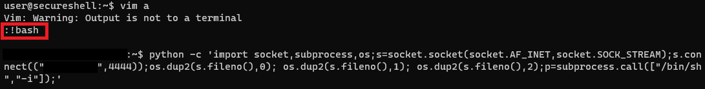

# Secure Shell

### Catégorie

Pwn

### Description

Une entreprise a apparemment trouvé le moyen de créer un shell sécurisé. 
Il est tellement sécurisé qu'il ne vous laisse.. rien faire. 

En tant que fan de sécurité vous doutez que cela soit 100% parfait. 
Votre but est de casser leur solution pour lire un fichier à la racine du serveur! 

Format : MCTF{}

### Auteur 

Worty

### Solution

Lorsqu'on arrive sur le challenge, on nous accueille avec le message suivant: 

  
On en déduit donc que nous sommes dans un shell restreint custom. Pour se rendre compte du filtrage, on peut essayer une petite énumération sur les commandes linux de base: 

  
Mh.. pas mal de commandes sont interdites et on n'a pas le droit de changer de répertoire. A coup d'énumération, on se rend compte que la commande vim n'est pas filtrée ! On peut donc lancer un bash depuis vim Mais dans ce shell, nous n'avons aucun retour de commandes, et il nous est impossible de quitter le shell sans le casser. 
Pour résoudre ce problème, nous allons ouvrir un reverse shell vers notre machine avec ce shell "inutile": 

  
Une fois la connexion reçu sur notre machine, on peut se balader avec un vrai shell, on va donc à la racine comme indiqué dans l'énoncé du challenge, et on trouve le fichier "secret_file.txt": 

  

### Flag

MCTF{0h_n0_y0u_3scp4p3_th3_s3cur3_sh3ll}