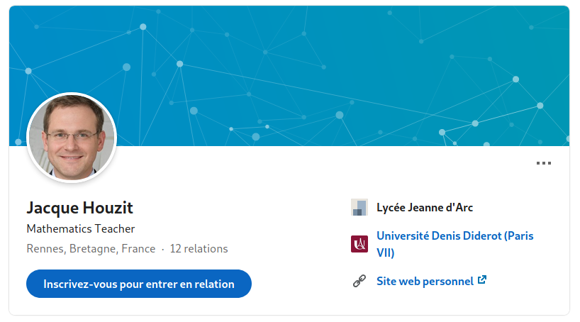

# Back To The Past 1/3

### Catégorie

OSINT

### Description

Back To The Past 1/3 (Difficulté : Facile)

Le lycée Jeanne d'Arc a récemment licencié Jacque Houzit, un professeur de Mathématiques. Il le suspecte de préparer une attaque informatique contre eux pour se venger.  
Ils font appel à vos services, enquêter et voyez ce que vous pouvez trouver.

### Auteur 

Kazuno

### Solution

D'après l'énoncé, on sait que l'on doit enquêter sur un certain Jacque Houzit. 
 
On fait donc une petite cherche Google : 

 

La recherche nous ressort un lien LinkedIn en premier lien, on visite donc ce compte : 

 

Le compte semble appartenir à Jacque Houzit et correspond avec les informations de l'énoncé (Professeur de Mathématiques au lycée Jeanne d'Arc jusqu'en 2020)  
 
On peut remarquer aussi qu'un site personnel est rattaché à ce compte, on décide donc d'aller le visiter : 

 
 
On est redirigé vers son compte GitHub, on décide donc d'investir un peu à la recherche de données intéréssantes. 
 
Après quelques minutes on peut trouver un répertoire nommé "Hacking" dans lequel se trouve un dossier "Preparation" qui lui-même contient un README.md avec le lien d'un pastebin destiné à "Archangel" :  

 
 
On accède donc au pastebin qui contient un fichier "go_back_to_the_past" mais qui semble protégé par un mot de passe :  

 
 
Au vu du nom du fichier, on se doute qu'il faut utiliser Wayback Machine afin de retourner dans le passé et peut-être trouver de nouvelles informations intéressantes :  
On colle donc le lien du pastebin dans Wayback qui nous retourne deux snapshots :  

 
 
On regarde le contenu du premier snapshot fait le 6 février :  

 
 
On trouve maintenant un fichier nommé password, on regarde son contenu en cliquant dessus :  

 
 
On utilise le mot de passe pour débloquer le fichier "go_back_to_the_past" sur le pastebin du présent :  

 

### Flag
 
MCTF{4lw4S_l00k_4t_Th3_P4sT}
