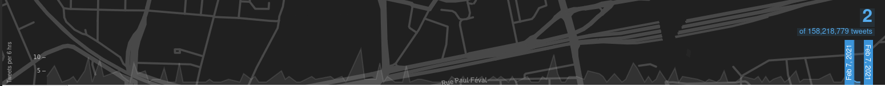
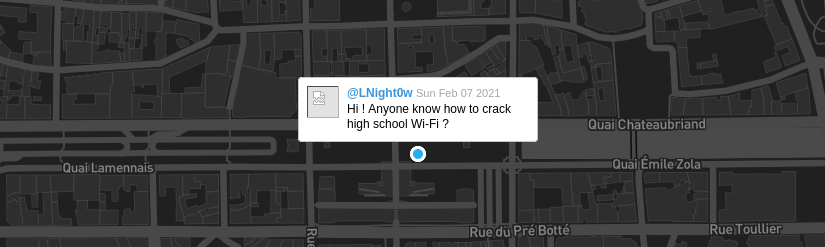
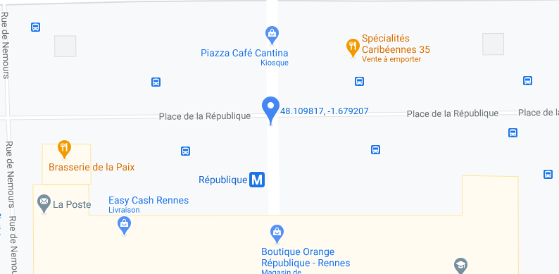
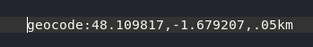
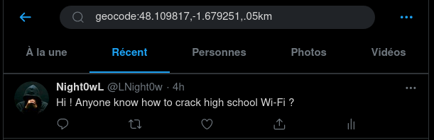

# Back To The Past 2/3

### Catégorie

OSINT

### Description

Back To The Past 2/3 (Difficulté : Moyen)

Grâce à vos informations, le directeur du lycée a pu retrouver Jacques Houzit en consultant l'historique des caméras de la ville de Rennes. Il agissait bizarrement et était constamment sur son téléphone. Avec les informations que vous avez récoltées, faites votre possible pour retrouver son compte Twitter.

Format : MCTF{NomUtilisateur}

### Auteur 

Kazuno

### Solution

D'après le challenge précédent, on sait que : 

 - Jacques Houzit à donné rendez-vous à une personne place de la République à Rennes
 - Le Pastebin et le GitHub ont été créé le 6/02/2021 et le message du challenge précédent indique "Rendez-vous demain à 14h"
 - Ils ont donc rendez-vous le 7/02/2021 à 14h place de la République à Rennes

Grâce à ces informations, on peut utiliser soit une "TweetMap" (n'importe laquelle) soit les dorks de Twitter pour retrouver le compte Twitter. 
Le plus intéressant ici est la TweetMap car les informations récoltées sont assez précises.  

- Avec une "TweetMap" : 

J'utilise ici la "TweetMap" d'OmniSci : https://www.omnisci.com/demos/tweetmap 
On filtre pour ne voir que les tweets du 7 février 2021 : 

 

On zoom ensuite sur la place de la République à Rennes et on regarde les tweets envoyés depuis ce lieu. 
On repère rapidement ce Tweet très étrange : 

  

- Avec les dorks de Twitter : 

On commence par récupérer des coordonées GPS via Google Map en se plaçant sur la place de la République à Rennes : 

 

On peut maintenant créer le dork via geocode. 
On spécifie une surface de 500m autour des coordonnées GPS pour ne pas passer à côté du Tweet : 

 

On utilise le dork sur Twitter, on regarde les tweets récent et trouve le compte Twitter de Jacques Houzit : 

 

### Flag
 
MCTF{LNight0w}
