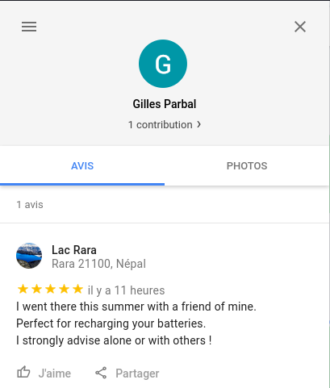

# Back To The Past 3/3

### Catégorie

OSINT

### Description

Back To The Past 3/3 (Difficulté : Moyen) // 3 essais maximum

Jacque Houzit a été licencié car il consommait du cannabis sur son lieu de travail. Le directeur du lycée le suspecte de s'être fourni sur une plaque tournante à l'étranger.
Retrouvez dans quel pays il est parti cet été.

Format : MCTF{Pays} 

### Auteur 

Kazuno

### Solution

Grâce au challenge précédent, nous avons maintenant accès au compte Twitter de Jacque Houzit.  
On fouille un peu et on remarque qu'il est suivit par "Archangel", celui avec qui il avait eu rendez-vous à Rennes le 7/02/2021 : 

 

On se rend donc sur son compte Twitter à la recherche d'infomations intéressante. 
On peut remarquer deux choses intéressantes :
- Le mail de contact épinglé sur son Twitter 
- Un Tweet où l'on peut comprendre qui l'est parti en vacances avec Jacque Houzit  

 
 
À partir de ces informations, on se doute qu'il faut enquêter sur Archangel afin d'obtenir des informations sur le lieu de leur voyage. 
On retourne sur l'adresse mail qui est épinglée sur le Twitter.  
Il est possible d'obtenir beaucoup d'informations simplement avec une adresse mail. 
Par exemple, un outil très utilisé en OSINT est Ghunt, qui permet d'obtenir des informations sur un compte google à partir d'une adresse mail. 
On regarde donc du côté de Ghunt pour voir si l'adresse mail appartient à un compte Google et si des informations son disponible sur celui-ci : 

 

Bingo ! Ghunt nous retourne même un lien vers un avis posté par ce compte Google : 

  

L'avis dit qu'il s'est rendu sur le lac de Rara au Népal avec un ami à lui cet été. Or, sur son profil tweeter on a pu lire un tweet où il repensait à un voyage avec Jacque Houzit.

### Flag
 
MCTF{Népal}
