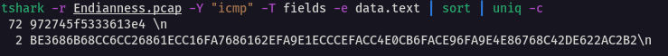

# Endianness

## Catégorie

Réseau

## Description

Lors d'une partie de Ping-Pong, un échange à été disputer avec beaucoup d'intensité par les joueurs. Essayer de comprendre pourquoi :)

Format : MCTF{}

## Hints

Hint 1 : "C'est la base !"

## Auteur

N3oWind

## Solution

Tout d'abord, on ouvre la capture Endianness.pcap dans l'outil wireshark. On retrouve une multitutde d'échange du protocol ICMP qui correspond à un ping. On peut commencer par filtrer la capture sur les requêtes ou sur les réponses. Pour cela "icmp.type==8" (request) ou "icmp.type==0" (reply)

Ensuite on remarque que la trame 39 est différentes des autres. On va donc exfiltrer la data avec tshark qui est la version CLI de wireshark.

exfiltrer la data avec la commande : 

```
tshark -r toto.pcap -Y "icmp" -T fields -e data.text | sort | uniq -c
```

On obtient :

> BE3686B68CC6CC26861ECC16FA7686162EFA9E1ECCCEFACC4E0CB6FACE96FA9E4E86768C42DE622AC2B2


<br/>

Grâce au hint "c'est la base", on sait qu'on doit changer notre hexa en binaire (base2) :

> 010011010100001101010100010001100111101101000010001100010110111001100001011100100111100101011111011010010111001101011111011011010011000001110010001100110101111101110011001100110111100001111001010111110111010001101000011000010110111001011111011010000011001101111000011000010110010000110011011000110011000101101101011000010110110001111101

On inverse le code binaire (le premier bit devient le dernier ect...) grace à un petit script python par exemple :

```python
#!/usr/bin/env python3

bit_s = '010011010100001101010100010001100111101101000010001100010110111001100001011100100111100101011111011010010111001101011111011011010011000001110010001100110101111101110011001100110111100001111001010111110111010001101000011000010110111001011111011010000011001101111000011000010110010000110011011000110011000101101101011000010110110001111101'


def inverse(binaire):

    toto = binaire
    resultat = ""
    i = len(toto) - 1
    while i >= 0:
        resultat += toto[i]
        i -= 1
    return resultat

print(inverse(bit_s))
```


> 101111100011011010000110101101101000110011000110110011000010011010000110000111101100110000010110111110100111011010000110000101100010111011111010100111100001111011001100110011101111101011001100010011100000110010110110111110101100111010010110111110101001111001001110100001100111011010001100010000101101111001100010001010101100001010110010

puis on refait un binaire to hexacécimal :

> 4d4354467b42316e6172795f69735f6d3072335f733378795f7468616e5f68337861643363316d616c7d

Et enfin héxadécimal to ascii text :) 

> MCTF{B1nary_is_m0r3_s3xy_than_h3xad3c1mal}
