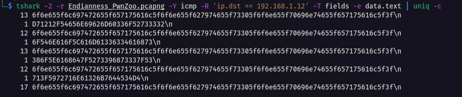
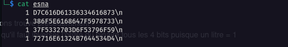

# Endianness PwnZoo

## Catégorie

Réseau

## Description

Lors d'une partie de bière-pong bien arrosée. Les deux joueurs se sont mis à débattre sur la création d'une nouvelle catégorie en CTF... Le PwnZoo, il s'agit d'un mix entre du Pwn et du Réseau. Analysez cette capture réseau et essayez de comprendre les arguments des joueurs lors de ce débat endiablé :)

Format : MCTF{}

## Hints

Hint 1 : "C'est la base !"

## Auteur

N3oWind

## Solution

Tout d'abord, on ouvre la capture Endianness_PwnZoo.pcap dans l'outil wireshark. On retrouve une multitude d'échange du protocol ICMP qui correspond à un ping. On peut commencer par filtrer la capture sur les requêtes ou sur les réponses. Pour cela "icmp.type==8" (request) ou "icmp.type==0" (reply)

Pour commencer, je décide d'extraire la data dans la plupart des trames, on retrouve 

Ensuite on remarque que les trames 27 / 53 / 81 et 107 sont différentes des autres. On va donc exfiltrer la data de l'ensemble des trames avec tshark qui est la version CLI de wireshark.

Exfiltrer la data avec la commande : 

```
tshark -2 -r Endianness_PwnZoo.pcapng -Y icmp -R 'ip.dst == 192.168.1.12' -T fields -e data.text | uniq -c > esna
```

On obtient :


<br/>

Par curiosité j'essaye de décoder l'hexa sur cyberchef, rien d'extraordinaire pour les 4 trames qui semble contenir quelque chose, cependant quand je decode "6f6e655f6c697472655f657175616c5f6f6e655f627974655f73305f6f6e655f70696e74655f657175616c5f3f" j'obtiens quelque chose en ascii qui ressemble fortement à un "INT"

```
one_litre_equal_one_byte_s0_one_pinte_equal_?
```

Ensuite, grâce au hint "c'est la base", on sait qu'on doit changer notre hexa en binaire (base2) et pour cela je décide tout d'abord de mettre bout à bout la data de chaque trame icmp (vu qu'il s'agit d'un ping, on prend uniquement les requêtes ou les réponses) grâce à la commande :

```
tshark -2 -r Endianness_PwnZoo.pcapng -Y icmp -R 'ip.dst == 192.168.1.12 && ! data.text contains "6f6e655f6c697472655f657175616c5f6f6e655f627974655f73305f6f6e655f70696e74655f657175616c5f3f"' -T fields -e data.text | uniq -c > esna
```

On obtient donc uniquement l'hexa contenu dans nos 4 trames vu qu'on a décider d'exclure les trames qui contenait l'indice "one_litre_equal_one_byte_s0_one_pinte_equal_?". 


<br/>

On rassemble l'hexa des quatres trames ce qui nous donne : 

> D71212F54656E69626D60336F527333326F546E616F5C616D61336334616873386F5E6168647F5273396873337F53713F5972716E61326B7644534D4

Ensuite on passe l'hexa en binaire :

> 110101110001001000010010111101010100011001010110111001101001011000100110110101100000001100110110111101010010011100110011001100110010011011110101010001101110011000010110111101011100011000010110110101100001001100110110001100110100011000010110100001110011001110000110111101011110011000010110100001100100011111110101001001110011001110010110100001110011001100110111111101010011011100010011111101011001011100100111000101101110011000010011001001101011011101100100010001010011010011010100

Enfin, grace au titre du challenge "Endianness" et à l'indice que nous avons trouvé précédemment "one_litre_equal_one_byte_s0_one_pinte_equal_?", on comprend donc qu'il faut inverser l'ordre du binaire tous les 4 bits puisque un litre = 1 byte (1 octet) donc une pinte = 4 bits.

Pour se faire j'ai décidé d'effectuer le changement grâce à un script python :

```python
#!/usr/bin/env python3

bit_s = '110101111100011000010110110101100001001100110110001100110100011000010110100001110011001110000110111101011110011000010110100001100100011111110101100101111000011100110011001101111111010100110011001001110000001111010110111101010011011110010110111101011001011100100111000101101110011000010011001001001011011101100100010001010011010011010100'

def inverse(binaire):
    final = ""
    iter=(len(binaire)//4)-1
    while iter >= 0:
        i = 0
        while i < 4:
            final += binaire[iter*4+i]
            i += 1
        iter -= 1
    return final

print(inverse(bit_s))
```

Ce qui nous donne : 

> 010011010100001101010100010001100111101101100010001100010110111001100001011100100111100101011111001100010111001101011111011100110011001101111000011010010011001101110010010111110111010001101000011000010110111001011111011010000011001101111000011000010110010000110011011000110011000101101101011000010110110001011111011000010110111001100100010111110110001000110011001100110111001001011111011000110011000001101101011000100110100101101110011001010110010001011111001000010010000101111101

puis on refait un binaire to hexacécimal (ou directement binary to ascii):

> 4D4354467B62316E6172795F31735F7333786933725F7468616E5F68337861643363316D616C5F616E645F623333725F63306D62696E65645F21217D

Et enfin héxadécimal to ascii text :) 

> MCTF{b1nary_1s_s3xi3r_than_h3xad3c1mal_and_b33r_c0mbined_!!}
