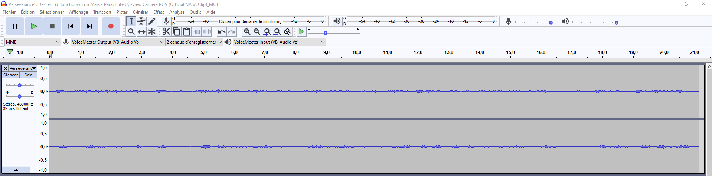
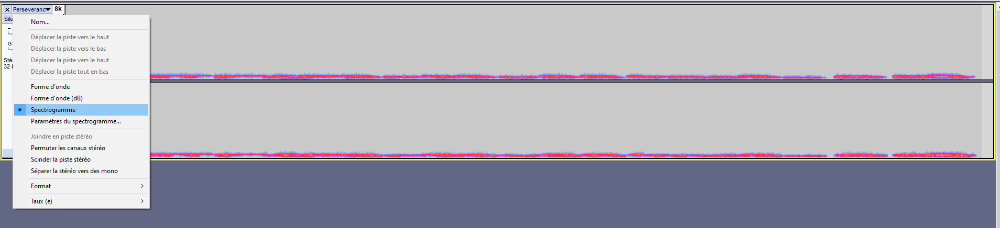
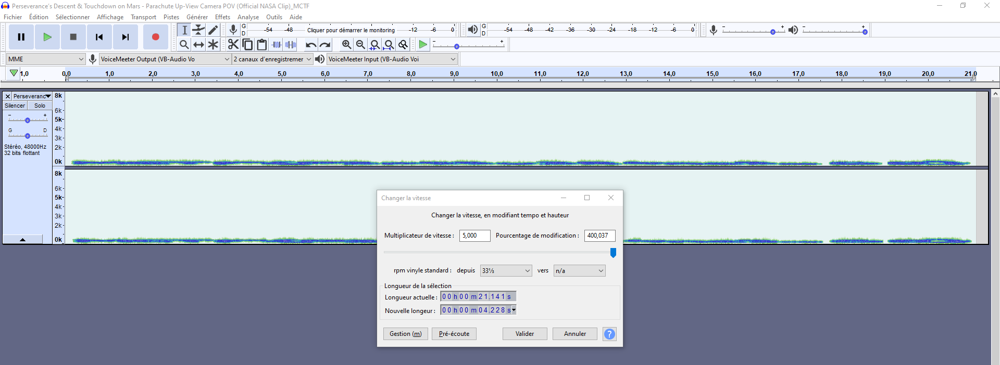

# The hidden message

### Catégorie

Stegano

### Description

La NASA vient de recevoir les premières images de son nouveau rover marsien Perseverance 

Depuis quelques heures, le Command Control aurait des problèmes pour envoyer les instructions au rover... Selon eux, le vent martien brouillerait les communications avec le rover. 

En tant que fin connaisseur, vous sentez que quelque chose cloche, mais quoi... 

Votre but est de trouver ce détail et de prévenir la NASA au plus vite. 

Bonne chance citoyenne, citoyen !  

Format : MCTF{}

### Auteur

A0d3n

### Solution

1 – Un gif du rover Perseverance contenant une archive ZIP.
 
2 – Dans l’archive, on trouve :
• Un fichier txt
• Une archive protéger par un mdp
 
3 – Sur le fichier txt, on utilise un strings pour trouver le mdp de l’archive.
 
4 – Dans l’archive, on trouve la vidéo qu’il faut ouvrir avec Audacity pour trouver le flag cacher dans le spectrogramme.
 

Ouvrir le fichier au format mp4 dans Audacity 

  

Puis, on sélectionne l'option "Spectrogramme" dans le menu déroulant de notre piste audio.

  

Enfin, on modifie la vitesse de lecture de notre piste audio au maximum.

  

Voilà, vous venez de trouver le flag !

### Flag

MCTF{P3r53v3R4nc3_G0}
