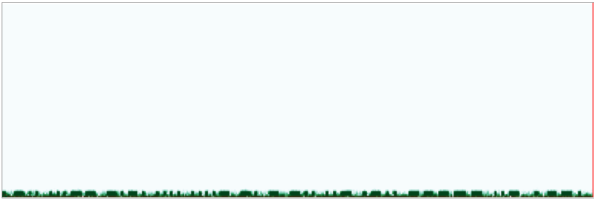

# WWI

### Catégorie

Stéganographie (Difficulté : Facile)

### Description

Un enregistrement audio datant de la Première Guerre mondiale a été retrouvé. Il a été transmis depuis un sous-marin français.  
Pouvez-vous vérifier qu'il ne contient pas de message caché ?

Format : MCTF{FLAG}

### Auteur 

Kazuno

### Solution

Lors de la lecture du fichier audio, on se rend rapidement compte qu'un code en morse défile le long de l'enregistrement audio. 

On peut alors essayer de le décoder de plusieurs manière différentes :

	- On ralentit l'audio via un convertisseur en ligne puis on écrit à la main le code morse
	- On utilise un décodeur audio en ligne afin de visualiser le code en morse utilisé

J'ai une préférence pour la deuxième solution.  

On se rend sur le site : https://morsecode.world/international/decoder/audio-decoder-adaptive.html et on upload l'audio :  

 

On peut alors distinguer le code morse et commencer à le réecrire au propre, on obitent alors : 
.-.. ...-- -.-. .... ....- -. - -.. ..- .-.. ----- ..- .--.  

On le decode via le site : https://www.dcode.fr/code-morse et on obtient le flag : 

 

### Flag
 
MCTF{L3CH4NTDUL0UP}
