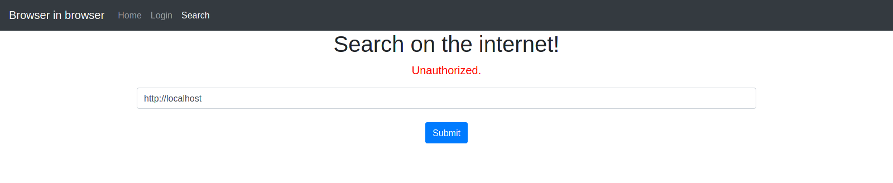
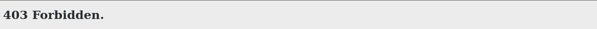
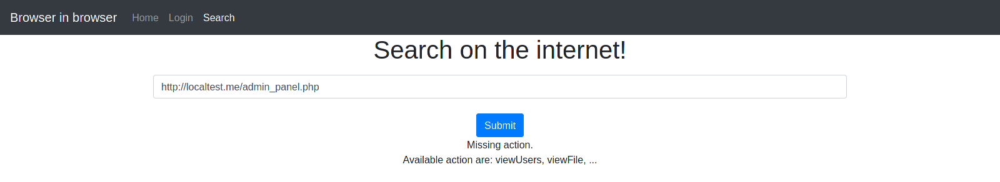

# Browser In Browser

### Catégorie

Web

### Description

Une entreprise vous propose de naviguer sur internet à l'aide de leur site web. Cela permet de faire passer les sites à visiter dans une sandbox, permettant
d'éviter la visite de site malveillant. Etant une version alpha, vous êtes mandaté pour auditer ce site web.

Format : MCTF{}

### Auteur 

Worty

### Solution

Quand on arrive sur ce challenge, on se rend compte que la page de login ne sert pas à grand chose. 
On va donc directement s'intéresser à la page de recherche, on peut donc facilement penser à essayer de requêter sur le localhost: 

  

On voit que les inputs utilisateurs sont quand même filtrées, pour éviter de requêter sur le localhost. Ici, on tente d'exploiter une faille de type SSRF. 
Après un peu de recherche sur internet, on trouve des moyens de bypass cette restriction: 

  

On a donc trouvé un moyen de leak la page "index" mais avec comme adresse IP "127.0.0.1", on a donc maintenant le nom de la page admin : "admin_panel.php" 

  

Ici, on peut donc en déduire que l'accès à l'admin panel se fait aussi via le localhost, on va donc utiliser notre SSRF pour requêter dessus. 

  

### Flag

MCTF{ssrf_t0_4cc3ss_4dm1n_p4rt}