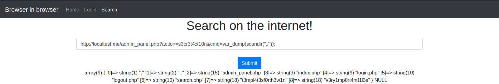
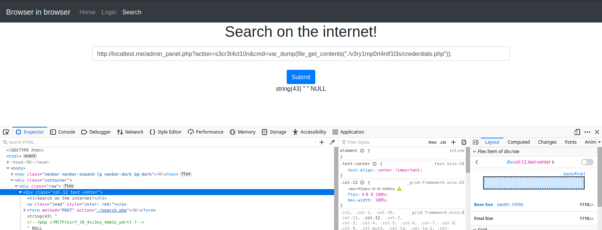

# Browser In Browser

### Catégorie

Web

### Description

Une entreprise vous propose de naviguer sur internet à l'aide de leur site web. Cela permet de faire passer les sites à visiter dans une sandbox, permettant
d'éviter la visite de site malveillant. Etant une version alpha, vous êtes mandaté pour auditer ce site web.

Format : MCTF{}

### Auteur 

Worty

### Solution

Quand on arrive sur ce challenge, on se rend compte que la page de login ne sert pas à grand chose. 
On va donc directement s'intéresser à la page de recherche, on peut donc facilement penser à essayer de requêter sur le localhost: 

  

On voit que les inputs utilisateurs sont quand même filtrées, pour éviter de requêter sur le localhost. Ici, on tente d'exploiter une faille de type SSRF. 
Après un peu de recherche sur internet, on trouve des moyens de bypass cette restriction: 

  

On a donc trouvé un moyen de leak la page "index" mais avec comme adresse IP "127.0.0.1", on a donc maintenant le nom de la page admin : "admin_panel.php" 

  

Ici, on peut donc en déduire que l'accès à l'admin panel se fait aussi via le localhost, on va donc utiliser notre SSRF pour requêter dessus. 

  

Maintenant, il va falloir leaker le fichier "admin_panel.php", pour ca, on va se servir de l'action "viewFile", et l'on va utiliser le wrapper "php://" dans 
le paramètre "file", pour leaker en base64 le contenu de ce fichier: 

  

Il suffit simplement de décoder la base64, pour obtenir le contenu du fichier .php: 

  

Dans le code, on remarque rapidement une action "secrète" cacher par les développeurs de l'application. Cette action permet d'exécuter des commandes php,
néanmoins, certaines fonctions sont interdites, comme "shell_exec" ou "exec", il n'est donc pas possible d'avoir une exécution de code à distance, du moins
pas comme cela. On va donc utiliser la fonction scandir() pour voir si l'on peut obtenir des fichiers importants de l'application: 

  

On remarque la présence d'un répertoire suspect, "v3ry1mp0rt4ntf1l3s", on va donc aller lister aussi ce répertoire: 

  

Ici, un fichier bien intéressant du nom de "credentials.php" apparaît directement, on va donc aller l'afficher avec la fonction file_get_contents: 

  

### Flag

MCTF{ssrf_t0_4cc3ss_4dm1n_p4rt}