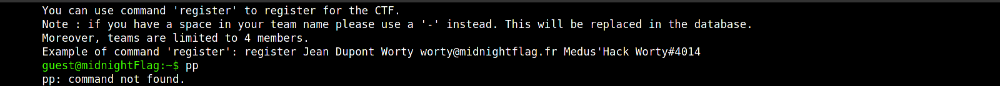
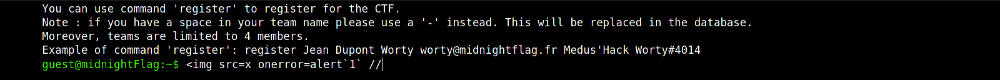
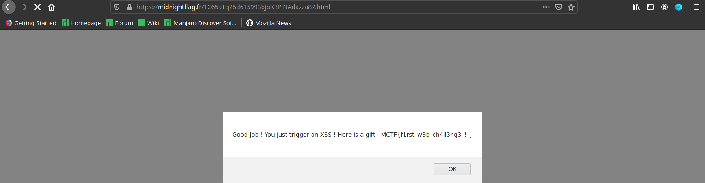

# Register (Bonus)

### Catégorie

Web

### Description

La page de register du CTF renferme un secret....

Format : MCTF{}

### Auteur 

Worty

### Solution

Lorsqu'on rentre une commande inconnue, la page répond en affichant cette dite commande: 

  

Ici, on peut donc tenter une XSS avec une balise image: 

  

Une fois que l'alert a été déclenché, on se voit rediriger vers une page qui nous donne le flag: 

  

### Flag

MCTF{f1rst_w3b_ch4ll3ng3_!!}