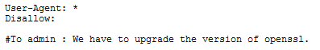
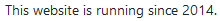
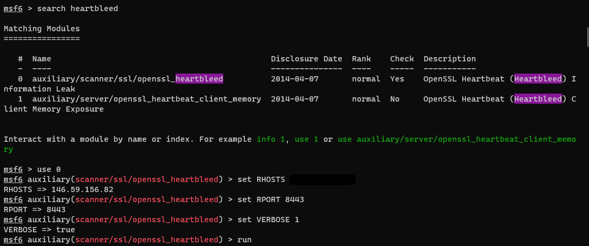
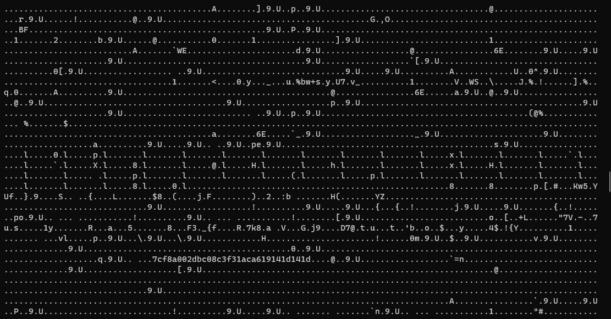
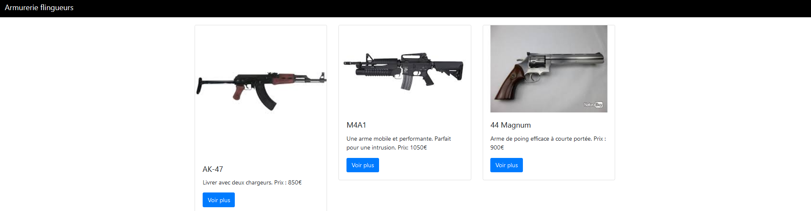
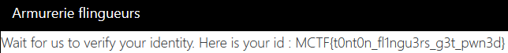

# Saignant s'il-vous-plaît

### Catégorie

Web

### Description

Une boucherie a un site mais les commentaires sur celui-ci sont bizarres...  
J'ai l'impression qu'ils vendent autre chose que des steaks mais je trouve pas le dossier ou la page où ils le font. A vous d'investiguer !

Format : MCTF{}

### Auteur 

Worty

### Solution

En arrivant sur le challenge, on remarque directement que le challenge tourne sous un serveur chiffrant les communications (https). 
On observe les commentaires, et en effet, un en particulier est bizarre puisqu'il est en Russe et indique "Merci pour la vente" 

Dans le fichier robots.txt, on peut remarquer la ligne: 

  

Par ailleurs, sur la page principale du site, tout en bas, on remarque: 

  

On cherche donc une faille en rapport avec OpenSSL et "2014", et on tombe directement sur la faille du nom de "heartbleed", qui permet de leak de la mémoire d'un serveur. 
Pour l'exploitation, j'ai choisi d'utiliser le module metasploit pour exploiter la faille: 

 

  

Dans ce leak mémoire, on remarque que la chaîne de caractères "7cf8a002dbc08c3f31aca619141d141d" reviens très régulièrement, on peut donc supposer que c'est le nom du fichier ou du dossier que l'on cherche. 

  

Notre intuition était bonne, on tombe bien sur le dossier caché, on essaye donc de cliqué pour commander une arme auprès des tontons flingueurs: 

 

### Flag

MCTF{t0nt0n_fl1ngu3rs_g3t_pwn3d}