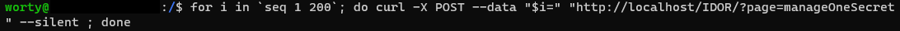

# Secret Manager

### Catégorie

Web

### Description

Après l'échec de son application Winventory, l'entreprise PHPBoomer a amélioré sa sécurité et a développé une nouvelle application. 
Secret Manager vous permet de stocké vos secrets sans que personne puisse y accéder 
Connaissant leur passé, on sait que la sécurité n'est pas maître chez eux.. 
Vous pouvez tester l'application?

Format : MCTF{}

### Auteur 

Worty

### Solution

Pour se connecter à se challenge, il suffit de fournir un pseudo. 
On créé donc un pseudo, et on commence à regarder l'application, elle ressemble beaucoup à Winventory, normal, puisque c'est la même entreprise qui l'a développé. 

  
On voit que l'on peut juste ajouter des secrets et voir ceux que l'on possède pour potentiellement les modifier / supprimer. 
Si l'on analyse la requête qui part quand on clique sur "modify" on observe ceci: 

  
On pourrait tenter des injection SQL dans le champ passé, mais cela n'est pas efficace, en effet, côté serveur, cela est bien géré. 
On peut donc penser à une injection de type IDOR, pour pouvoir accéder aux secrets de tout le monde, la payload est donc la suivante: 

  
Cela marche! On réussi à accéder aux secrets de tout le monde. Le secret de l'admin se trouve à l'id 142: 
curl -X POST --data "142=" "http://localhost/IDOR/?page=manageOneSecret" --silent 

### Flag

MCTF{IDOR_1nj3t10n_t0_st34l_s3cr3ts}